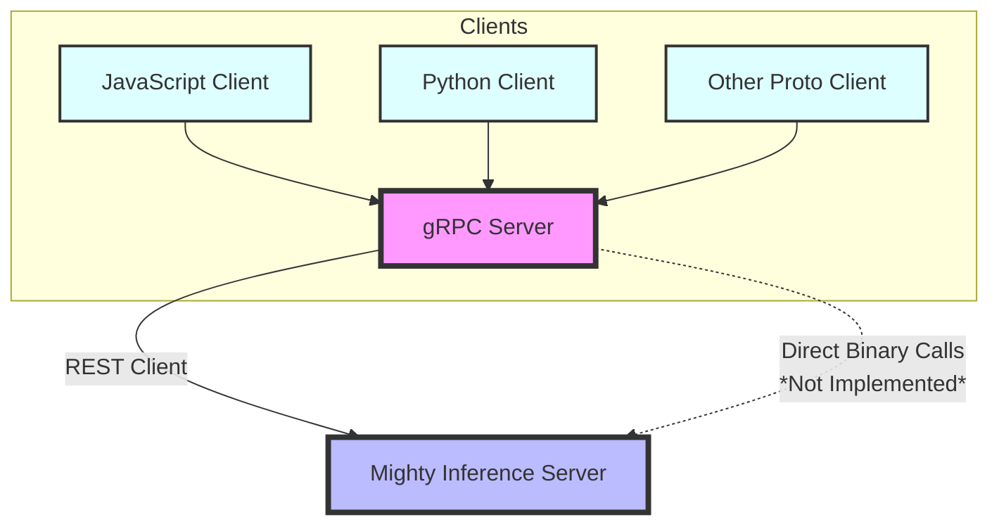

# gRPC Interface to the Mighty Inference Server

This Rust project implements a gRPC server for interacting with the [Mighty Inference Server](https://max.io/mighty.html). Currently, the Mighty Inference services 
are only available through its [REST API interface](https://max.io/documentation.html), so the communication is limited to a REST client.

This library, however, provides a consistent interface which _could_ be leveraged to make direct binary calls into the library while maintaining the same gRPC 
server interface. Presently, the `BinaryClient` implementation has not been completed as direct binary calls are not yet supported.

## Requirements
- [Rust](https://www.rust-lang.org/tools/install)
- [Mighty Inference Server](https://max.io/documentation.html)

## Installation

1. Clone the repository:

    ```bash
    git clone https://github.com/mbarth/mighty-grpc.git
    ```

2. Change to the project directory:

    ```bash
    cd mighty-grpc
    ```

3. Build the project:

    ```bash
    cargo build --release
    ```

## Usage

1. [Start](https://max.io/documentation.html#Installation%20and%20Quick%20Start) the Mighty Inference Server in a separate terminal. 
   Note the port number used as you'll update your configuration using this port in the next step.

2. The application settings are defined in a configuration file named `config.toml`. These settings include the gRPC server address and port, Mighty server configuration, 
and logging level.

    Example `config.toml` file:
    
    ```toml
    [grpc_server]
    address = "127.0.0.1"
    port = 50051
    
    [mighty_server]
    base_url = "http://localhost:5050"
    
    [logging]
    level = "debug"
    ```
    Update these values to match your environment in terms of available ports for the gRPC server and the URL used to access the Mighty server.

3. Start the gRPC server in another terminal using:

    ```bash
    cargo run --release --bin grpc
    ```

4. Access the gRPC server through your preferred client. Here is an example using [gRPCurl](https://github.com/fullstorydev/grpcurl):

    ```bash
    # Server supports reflection
    grpcurl -plaintext localhost:50051 describe mighty_inference_server.MightyInference
    
    # Using proto sources
    grpcurl -plaintext -import-path ./src/proto -proto mighty_inference.proto -d '{}' localhost:50051 mighty_inference_server.MightyInference.Metadata
    
    # Using reflection
    grpcurl -plaintext -d '{}' localhost:50051 mighty_inference_server.MightyInference.HealthCheck
    ```

## Client Examples

- There are two different client implementations examples available:
  - [JS Example](client-examples/js/README.md)
  - [Python Example](client-examples/python/README.md)

## Summary



## License

This project is licensed under the Unlicense. See the [LICENSE](LICENSE) file for details.
